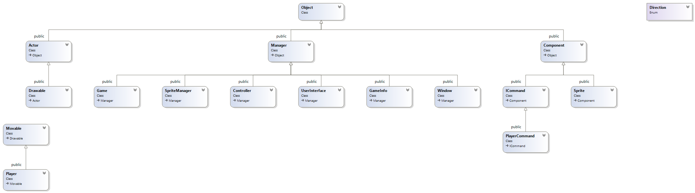

# SFML-GameFramework
After trying the Cinder library, I decided to come back to the SFML to create my Game Framework

## Project informations

* Platform : Windows
* IDE : Visual Studio 2017
* Additionnal libraries : SFML

## Class diagram

## Download

- 64 bits : http://adrien-givry.com/download/sfml-game-framework-x86.zip
